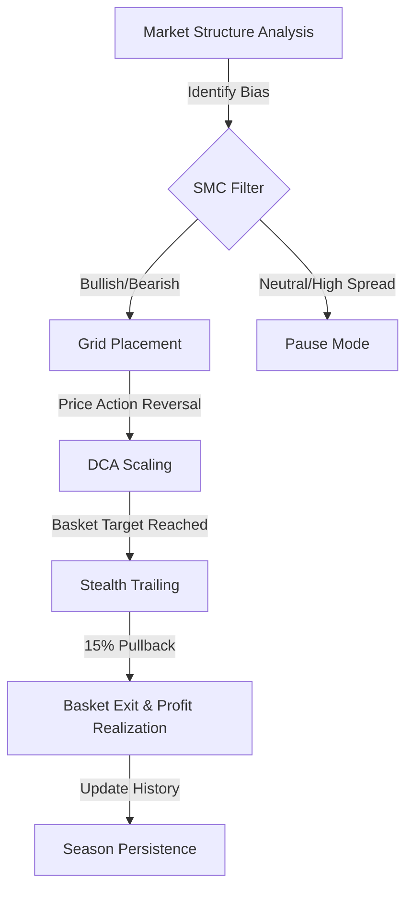

# 🧠 NEXT LEVEL: SC-RIG-D
## The Ultimate AI-Powered Trading Ecosystem (v2.0 - Performance Edition)

---

### 👤 **PREPARED BY**
**Aleem Shahzad**  
*Python & Next.js Full-Stack Architect*  
*Visionary of Integrated Trading Intelligence*

---

## 📌 What's New in v2.0?

> **⚠️ DISCLOSURE: This system is built FOR EDUCATIONAL PURPOSES ONLY. Use on Demo Accounts to learn AI and Grid Trading Logic.**

The latest update transforms **SC-RIG-D** from a standard grid bot into a high-yield **Hybrid SMC-Grid Engine**, specifically optimized for **Gold (XAUUSDm)** volatility.

### 🚀 **Key Performance Upgrades:**
1.  **Hybrid Execution**: ICT/SMC signals (Order Blocks, FVG) now act as filters and triggers for the Grid system. The bot only scales into positions when market structure aligns.
2.  **Increased Profit Yield**: Re-engineered **Adaptive Basket Exit** logic. Small baskets now target **$3.00/0.01 lot** (2x previous version), allowing trades to run for maximum value while maintaining safety.
3.  **Top-Tier Dashboard**: Relocated the **ICT Rail Board** to the performance bar for instant confluence monitoring.
4.  **Season Analytics**: Introduced the **Season Timer** to track continuous execution duration since the last history reset.

---

## 🛠️ **1. THE ENGINE: `live_trading.py`**

The heart of the system is the **Hybrid Intelligence Script**. It blends institutional SMC concepts with the mathematical reliability of grid trading.

### **Institutional Core:**
*   **SMC Confluence**: Automatically detects **Market Structure Shifts (MSS)**, **Fair Value Gaps**, and **Railway Tracks** to find high-probability reversal zones.
*   **Elastic Profit Targets**: Uses ATR-based trailing exits. If the market moves in your favor, the bot "stretches" its target to capture extra pips.
*   **Gold-First Optimization**: specifically tuned for XAUUSDm spread and volatility handling, with automatic switching to Bitcoin (BTCUSDm) during Gold holidays/weekends.
*   **1Hz Heartbeat**: Rapid position monitoring and safety checks every second.

---

## 📊 **2. THE CONTROL CENTER: `live_dashboard.py`**

The dashboard provides a premium, real-time tactical overview of your trading "Season."

### **Elite Visuals:**
*   **Integrated Rail Board**: High-visibility ICT status (MSS, OB, FVG, OTE) now sits at the very top of the performance bar.
*   **Season Duration**: Live ticking timer showing how long your current trading streak has been active.
*   **Dynamic Risk Monitor**: Real-time exposure projections for XAUUSDm moves, calculated 10x per second.
*   **Stealth Trailing Toggle**: Visual feedback when the bot enters "Trailing Mode" to lock in basket profits.

---

## 🔄 **3. THE HYBRID WORKFLOW**

1.  **SMC Validation**: The bot checks if the current zone is Discount (Buy) or Premium (Sell) before placing the first grid order.
2.  **Adaptive Scaling**: If price moves against the initial entry, the bot uses ATR-calculated spacing to build a "Basket."
3.  **Basket Exit**: Once the weighted average profit hits the new enhanced multi-dollar targets, the bot exits all trades instantly.

---

## 👥 **4. BACKEND & SCALING**

For professional operators, the system integrates with a **Django-based Backend**:
*   **Performance Archiving**: Every "Season" report is automatically saved as a professional Markdown and HTML report in `logs/live_reports/`.
*   **Discord Intelligence**: Real-time signal and performance updates sent directly to your channel every hour.

---

## ⚠️ **5. THE DISCLAIMER & EDUCATIONAL PURPOSE**

> [!IMPORTANT]
> **This software is created EXCLUSIVELY FOR EDUCATIONAL PURPOSES.**  
> It is a demonstration of automated trading concepts, AI-driven analysis, and complex grid management using Python and MetaTrader 5.

**Gold trading is highly volatile. SC-RIG-D v2.0 focuses on higher yield, which requires disciplined risk management.**
*   **Not Financial Advice**: Nothing in this repository represents a recommendation to trade live funds.
*   **Simulation vs Reality**: Always use a **Demo Account** to learn the bot's behavior. 
*   **Risk Rule #1**: Protecting capital is more important than chasing profit. Never trade with capital you cannot afford to lose.

---

### 🌟 **NEXT LEVEL TRADING SYSTEM**
*Where Intelligence Meets Trading Excellence.*  
**© 2026 Aleem Shahzad | NEXT LEVEL TRADING**
