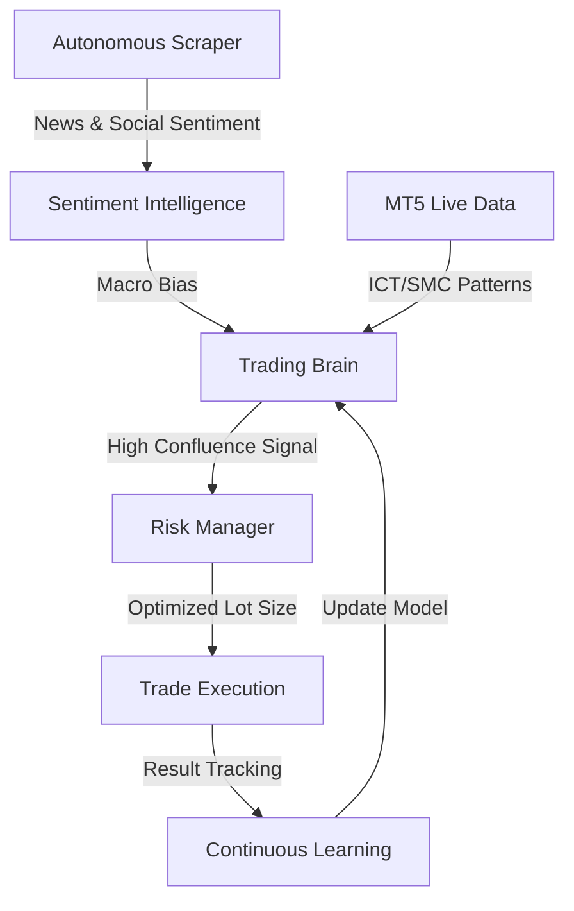

# 🧠 NEXT LEVEL: SC-RIG-D
## The Ultimate AI-Powered Trading Ecosystem

---
[](https://python.org)
[](https://metatrader5.com)
[](https://exness.com)
[](LICENSE)

### 👤 **PREPARED BY**
**Aleem Shahzad**  
*Python & Next.js Full-Stack Architect*  
*Visionary of Integrated Trading Intelligence*

---
## 📌 What Does This Bot Do?

NEXT LEVEL TRADING SYSTEM is a professional automated trading bot that connects to MetaTrader 5 and executes a **dynamic grid strategy** on real market data. It does **not** use any mocked, simulated, or fake data — all prices, fills, and account information come directly from your live MT5 terminal.


## 🚀 **1. WHAT IS SC-RIG-D?**

**SC-RIG-D** (*Smart Concept Real-time Intelligence Grid Dashboard*) is a comprehensive, institutional-grade trading ecosystem. It is not just a bot; it is a multi-layered synthesis of:

*   **S**mart & Scalable AI Logic
*   **C**oncept-driven ICT/SMC Technicals
*   **R**eal-time Data Acquisition
*   **I**ntelligent Sentiment Analysis
*   **G**rid-based Adaptive Execution
*   **D**ashboard-centric Performance Control

It bridges the gap between raw market data and profitable execution using cutting-edge Neural Networks and Professional Risk Management.

---

## 🛠️ **2. THE ENGINE: THIS SCRIPT (`live_trading.py`)**

The heart of the system is the **Live Trading Script**. This is where the magic of institutional logic meets automated speed.

### **Core Capabilities:**
*   **ICT/SMC Mastery**: Automatically detects **Order Blocks**, **Fair Value Gaps (FVG)**, and **Liquidity Sweeps**.
*   **Neural Analysis**: A PyTorch-powered **Trading Brain** that learns from every winning and losing trade.
*   **Multi-Asset Synchronization**: Seamlessly handles Gold (XAUUSD), Bitcoin (BTCUSD), and Major Forex pairs.
*   **10Hz Heartbeat**: Monitors the market 10 times per second to ensure zero-lag execution.

```python
# The logic core: Analyze -> Decision -> Risk -> Execution
brain.analyze_market(symbol, timeframe)
if brain.confluence_score > 0.7:
    broker.execute_smart_order(lots, tp, sl)
```

---

## 📊 **3. THE CONTROL CENTER: THIS BOARD (`live_dashboard.py`)**

**The Board** is your mission control. It transforms complex algorithmic data into a clean, interactive, and powerful visual interface.

### **Visual Intelligence:**
*   **Live Performance**: Real-time P&L tracking with high-definition charts.
*   **AI Ticker**: An infinite scrolling feed of the AI's "thoughts" and market bias.
*   **Emergency Reset**: Instant "Panic Button" to close all positions and protect capital.
*   **Risk Calculator**: Real-time margin and exposure projections for $10 to $300 Gold moves.

> *"The Dashboard doesn't just show data; it provides clarity in the heat of market volatility."*

---

## 🔄 **4. HOW IT SHOULD WORK (The Workflow)**

The SC-RIG-D ecosystem follows a rigorous 4-step execution lifecycle:



1.  **Intelligence Phase**: Scrapes Twitter, Reddit, and News to find what the "Smart Money" is doing.
2.  **Technical Phase**: Validates sentiment against ICT Market Structure.
3.  **Risk Phase**: Calculates position sizing based on account equity and volatility.
4.  **Learning Phase**: Remembers the outcome to refine future entry criteria.

---

## 👥 **5. MANAGING USERS (The Platform Backend)**

For scaling and commercialization, the system includes a robust **User & MLM Management System** built on **Django**.

### **Administrative Power:**
*   **Multi-Tenant Architecture**: Manage thousands of users with separate API keys and trading configurations.
*   **Wallet Ecosystem**: Integrated wallets for **Deposits**, **Staking**, **Daily Profits**, and **Referral Commissions**.
*   **2FA & Security**: Institutional-grade security with TOTP authentication for all user accounts.
*   **Referral Trees**: Built-in Multi-Level Marketing (MLM) logic to reward community growth.

---

## ⚠️ **6. THE DISCLAIMER**

**Trading involves significant risk. The SC-RIG-D system is a powerful tool, but it is not a guarantee of profit.**

*   Past performance does not guarantee future results.
*   Always test configurations on Demo accounts before deploying live capital.
*   Aleem Shahzad and the Development Team are not responsible for financial losses incurred through the use of this software.
*   **Risk Rule #1**: Never trade with money you cannot afford to lose.

---

### 🌟 **NEXT LEVEL TRADING SYSTEM**
*Where Intelligence Meets Trading Excellence.*  
**© 2026 Aleem Shahzad | NEXT LEVEL TRADING**
